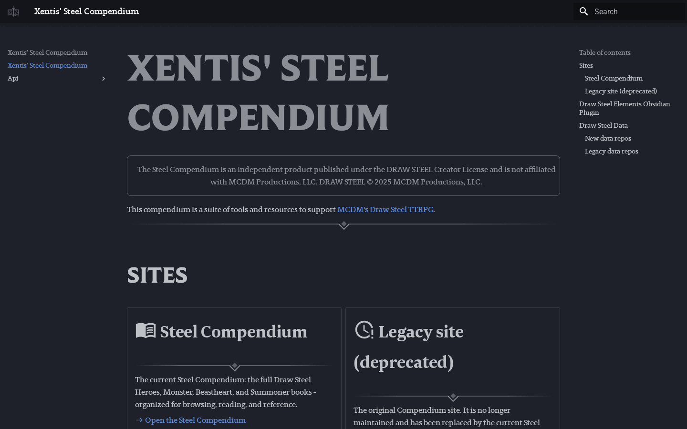

# Xentis' Steel Compendium

The Steel Compendium is an independent product published under the DRAW STEEL Creator License and is not affiliated with MCDM Productions, LLC. DRAW STEEL © 2024 MCDM Productions, LLC.

---

This code backs the steelcompendium.io site at [steelCompendium.io](steelCompendium.io)

## What it looks like

The [root landing page](https://steelcompendium.io/) — links out to the current Steel Compendium, the deprecated legacy site, and the SCC data/API repos.

## Licensed fonts (keep private)

This site is the one host of the licensed **Berlingske Slab** web fonts for every
steelcompendium.io site. It serves them at `/fonts/licensed/berlingske-slab/`. CI fetches
them from the private `SteelCompendium/licensed-fonts` repo at build time and deploys
through a GitHub Pages artifact. **Never commit the font files here**: this repo is
public. For a local preview with the real fonts, run `just serve`, which runs
`just fonts` first. Rules: the workspace `ARCHITECTURE.md` → "Licensed fonts".
