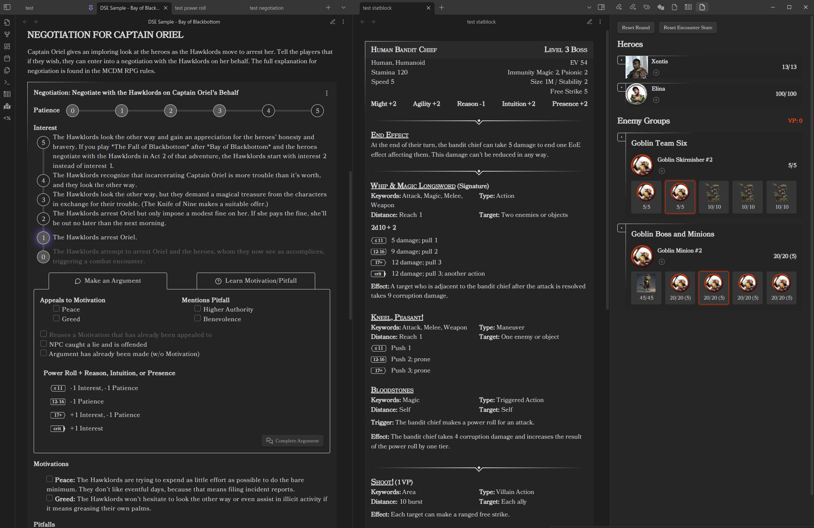

# Xentis' Steel Compendium

> The Steel Compendium is an independent product published under the DRAW STEEL Creator License and is not affiliated with MCDM Productions, LLC. DRAW STEEL © 2025 MCDM Productions, LLC.

This compendium is a suite of tools and resources to support 
[MCDM's Draw Steel TTRPG](https://www.backerkit.com/c/projects/mcdm-productions/mcdm-rpg).

---

## Sites

-   #### :material-book-open-variant: Steel Compendium

    ---

    The current Steel Compendium: the full Draw Steel Rules and Monsters book, organized for
    browsing, reading, and reference.

    [:octicons-arrow-right-24: Open the Steel Compendium](https://steelcompendium.io/v2)

    <!-- TODO: replace with a v2 screenshot -->

-   #### :material-clock-alert-outline: Legacy site (deprecated)

    ---

    The original Compendium site. It is **no longer maintained** and has been replaced by the
    current Steel Compendium (v2); it is kept available for now.

    [:octicons-arrow-right-24: Open the legacy site](./compendium)

## [Draw Steel Elements](https://steelcompendium.io/draw-steel-elements/) Obsidian Plugin

[Draw Steel Elements](https://steelcompendium.io/draw-steel-elements/) is a plugin for [Obsidian](https://obsidian.md/), a markdown note-taking tool that can be very helpful for TTRPG prep and play.

- [Draw Steel Elements Plugin Install](https://obsidian.md/plugins?id=draw-steel-elements)
- [Draw Steel Elements Documentation](https://steelcompendium.io/draw-steel-elements/)

## Draw Steel Data

Parsed variants of the Draw Steel rules and bestiary are distributed across several GitHub repos.

There is also an `npm` module for parsing and working with these models:

- [Github - data-sdk-npm](https://github.com/SteelCompendium/data-sdk-npm)
- [npmjs.com - steel-compendium-sdk](https://www.npmjs.com/package/steel-compendium-sdk)

-   #### :material-database: New data repos

    ---

    **:material-alert: Work in progress.** These are the new, SCC-coded data repos. They are
    **not yet production-ready** -- the structure may change and they may contain errors.

    - [data-rules](https://github.com/SteelCompendium/data-rules) -- Heroes book
    - [data-bestiary](https://github.com/SteelCompendium/data-bestiary) -- Monsters book
    - [data-unified](https://github.com/SteelCompendium/data-unified) -- everything, aggregated

    Each repo provides Markdown, Markdown for the Draw Steel Elements plugin, SCC-linked
    Markdown, JSON, and YAML variants under its `en/` directory.

-   #### :material-folder-clock: Legacy data repos

    ---

    **Deprecated.** These older repos are still available, but are being replaced by the new
    repos to the left.

    **Don't know which markdown to download?**

    - Using Obsidian with the Draw Steel Elements plugin? Use [data-md-dse](https://github.com/SteelCompendium/data-md-dse).
    - For any other purpose, use [data-md](https://github.com/SteelCompendium/data-md).

    *Unified (everything):*

    - [data-md](https://github.com/SteelCompendium/data-md) -- Markdown
    - [data-md-dse](https://github.com/SteelCompendium/data-md-dse) -- Markdown for the Draw Steel Elements Obsidian Plugin

    *Rules (Heroes book):*

    - [data-rules-md](https://github.com/SteelCompendium/data-rules-md) -- Markdown
    - [data-rules-md-dse](https://github.com/SteelCompendium/data-rules-md-dse) -- Markdown for the Draw Steel Elements Obsidian Plugin
    - [data-rules-yaml](https://github.com/SteelCompendium/data-rules-yaml) -- YAML
    - [data-rules-json](https://github.com/SteelCompendium/data-rules-json) -- JSON
    - [data-rules-xml](https://github.com/SteelCompendium/data-rules-xml) -- XML

    *Bestiary (Monsters book):*

    - [data-bestiary-md](https://github.com/SteelCompendium/data-bestiary-md) -- Markdown
    - [data-bestiary-md-dse](https://github.com/SteelCompendium/data-bestiary-md-dse) -- Markdown for the Draw Steel Elements Obsidian Plugin
    - [data-bestiary-yaml](https://github.com/SteelCompendium/data-bestiary-yaml) -- YAML
    - [data-bestiary-json](https://github.com/SteelCompendium/data-bestiary-json) -- JSON

    *Adventures* (not yet populated with data):

    - [data-adventures-md](https://github.com/SteelCompendium/data-adventures-md) -- Markdown

